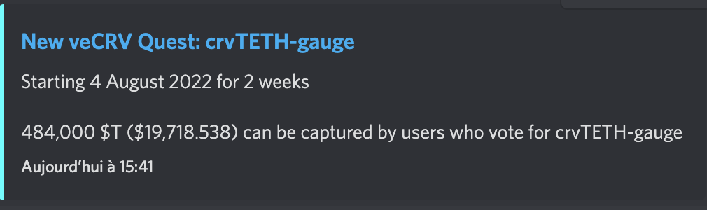

# Discord-Quest-Bot

Discord bot that send a message to one or more text / announcement channels whenever there is a new quest being created for **Curve** or **Balancer** on [Warden](https://github.com/PaladinFinance/Warden-Quest).

<div align="center">
  
</div>

## Dependencies & Installation

To start, make sure you have `node` & `yarn` installed : 
* `node` - tested with v16.16.0
* `yarn` - tested with v1.22.19

Then, clone this repo, and install the dependencies : 

```
git clone https://github.com/PaladinFinance/Discord-Quest-Bot.git
cd Discord-Quest-Bot
yarn
```

This will install all the depdencies needed for the project such as `discordjs`, `etherjs` ...

- You will need a discord bot so I suggest you create one following a tutorial like this [one](https://www.xda-developers.com/how-to-create-discord-bot/).
- Don't forget to invite to your server with a link of this form `https://discord.com/oauth2/authorize?client_id=CLIENT_ID&scope=bot&permissions=19456` which gives permission to the bot to **send messages**, **read messages / view channels** and **embed links**.
- On top of that you will need to give the permission to the bot to send messages in the target channel if it is a announcement channel.
- You can set the bot to public or private.

## Start

- First you need to set environment variables in the .env
- Then you can set the contract addresses for the two QuestBoard as *veCRVQuestBoardContractAddress* and *veBALQuestBoardContractAddress* inside the [data file](./src/data/data.json)
- In the same file you can set the discord channel ids where you want the bot to send the message in *balancerTargetChannelIds* and *curveTargetChannelIds*. You can get the channel id using [this](https://turbofuture.com/internet/Discord-Channel-ID) tutorial
- Finally you can start the discord bot with `yarn start`

## Ressources

Website : [paladin.vote](https://.paladin.vote)

Documentation : [doc.paladin.vote](https://doc.paladin.vote)


## Community

For any question about this project, or to engage with us :

[Twitter](https://twitter.com/Paladin_vote)

[Discord](https://discord.com/invite/esZhmTbKHc)

## License 

This project is licensed under the MIT license